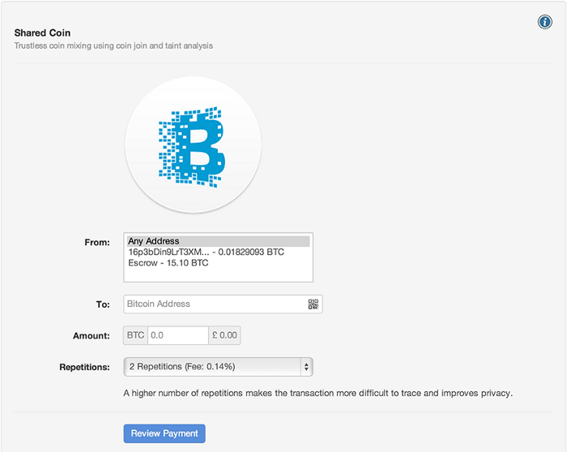

|               	| 				|
| ----------- 		| ----------	| 
| Project Name 		| Sharedcoin 		|
| Release Date		| 2013–11–03	|
| Bounty Post 		| [link](https://bitcointalk.org/index.php?topic=279249.msg3467698#msg3467698)		|
| Announcement Post | [link](https://bitcointalk.org/index.php?topic=40264.msg3367854#msg3367854)		|
| Dev				| piuk		|
| GitHub Page		| [link](https://github.com/blockchain/My-Wallet/blob/master/sharedcoin.js)		|
| Last Commit		| 20YY–MM–DD	|
| Demo				| [link]() | 

Removed from Blockchain.info wallet after an exploit (coinsoduku) was found that rendered it useless

